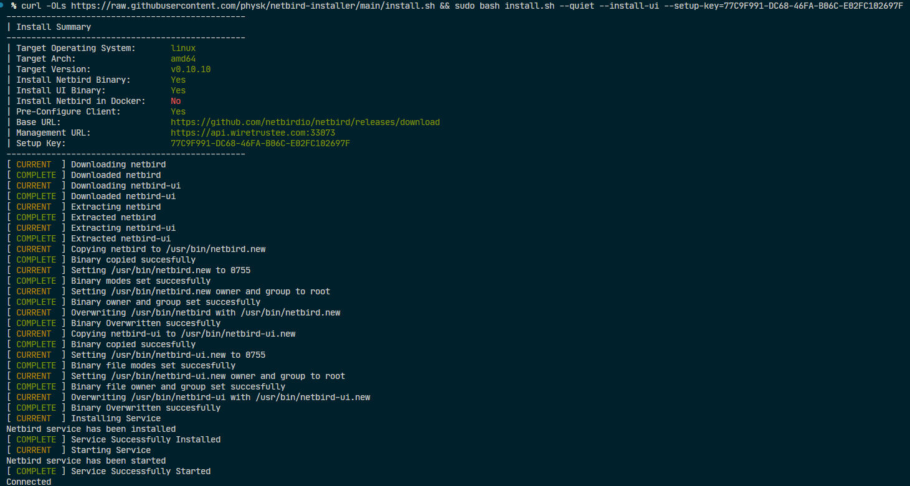

# Netbird Installer

This shell script will install the [Netbird](https://netbird.io) Client.

> This has only currently been tested on Debian 11 (Bullseye) although, it should work on any linux & darwin based system

You can pass the shell script arguments to allow it to do more things automaticly.

| Shorthand | Longhand | Default | Description |
| --- | --- | --- | --- |
| -h | --help | | Show Help |
| -ia | --install-app | true | Install Netbird Binary |
| -iui | --install-ui | false | Install Netbird UI Binary |
| -iv | --install-version | latest | Target Install Version |
| -d | --docker | false | Install Netbird in Docker |
| -ns | --no-service | false | Don't install and start service |
| -np | --no-preconfigure | false | Don't preconfigure Netbird |
| -b | --base-url | https://github.com/netbirdio/netbird/releases/download | Base URL for binary downloads (Allows script to be used in Air-Gapped Systems) |
| -m | --management-url | https://api.wiretrustee.com:33073 | Management URL (Defaults to Netbird SaaS) |
| -sk | --setup-key | | Setup Key |
| -q | --quiet | false | Don't prompt to confirm install |

# Setup

To do a fully automated install you could run the following (substituting your own setup key):

```bash
curl -OLs https://raw.githubusercontent.com/physk/netbird-installer/main/install.sh && sudo bash install.sh --quiet --install-ui --setup-key=77C9F991-DC68-46FA-B06C-E02FC102697F
```

